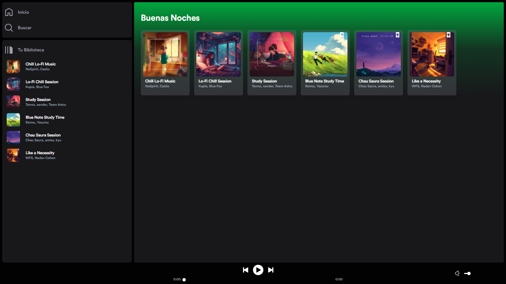
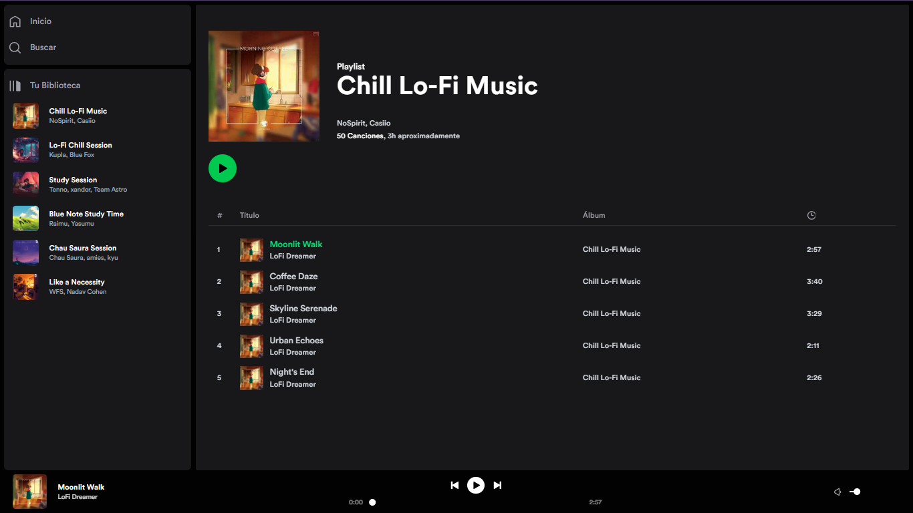

# 🎵 Spotify Astro Clone

Un clon funcional de Spotify construido con **Astro**, que replica la interfaz y experiencia de usuario de la popular plataforma de música en streaming.




## ✨ Características

- 🎧 Reproductor de música con controles completos (play, pause, volumen, progreso)
- 📂 Navegación por playlists con rutas dinámicas
- 🎨 UI fiel al diseño de Spotify con tema oscuro
- ⚡ Transiciones de vista suaves con el `ClientRouter` de Astro
- 📱 Layout responsive con grid CSS
- 🔤 Tipografía oficial `CircularStd`

## 🛠️ Stack tecnológico

| Tecnología                               | Uso                                |
| ---------------------------------------- | ---------------------------------- |
| [Astro](https://astro.build/)            | Framework principal + SSR          |
| [React](https://react.dev/)              | Componentes interactivos (Player)  |
| [Svelte](https://svelte.dev/)            | Componentes reactivos ligeros      |
| [Tailwind CSS](https://tailwindcss.com/) | Estilos utilitarios                |
| [Zustand](https://zustand-demo.pmnd.rs/) | Estado global del reproductor      |
| [Radix UI](https://www.radix-ui.com/)    | Componentes UI accesibles (Slider) |
| [Vercel](https://vercel.com/)            | Deploy y hosting                   |
| [Bun](https://bun.sh/)                   | Package manager y runtime          |

## 🚀 Project Structure

Inside of your Astro project, you'll see the following folders and files:

```text
/
├── public/
│   ├── favicon.svg
│   ├── favicon.ico
│   ├── music
│   └── fonts
├── src
│   ├───assets
│   │       astro.svg
│   │       background.svg
│   │
│   ├───components
│   │       AsideMenu.astro
│   │       CardPlayButton.jsx
│   │       Greeting.svelte
│   │       MusicsTablePlay.tsx
│   │       MusicTable.tsx
│   │       Player.jsx
│   │       PlayerControlButtonBar.jsx
│   │       PlayerCurrentSong.jsx
│   │       PlayerSoundControl.jsx
│   │       PlayerVolumeControl.jsx
│   │       PlayerVolumeIconComponent.tsx
│   │       PlayListItemCard.astro
│   │       SideMenuCard.astro
│   │       SideMenuItem.astro
│   │       Slider.tsx
│   │
│   ├───icons
│   │       Home.astro
│   │       Library.astro
│   │       MusicsTableIcons.tsx
│   │       Play.astro
│   │       PlayerIcons.tsx
│   │       Search.astro
│   │       VolumeIcons.tsx
│   │
│   ├───layouts
│   │       Layout.astro
│   │
│   ├───lib
│   │       colors.ts
│   │       data.ts
│   │
│   ├───pages
│   │   │   index.astro
│   │   ├───api
│   │   │       get-info-playlist.json.js
│   │   │
│   │   └───playlist
│   │           [id].astro
│   ├───service
│   │       ApiService.ts
│   │
│   ├───store
│   │       playerStore.ts
│   │
│   └───styles
│           global.css
├── bun.lock
├── astro.config.mjs
└── package.json
```

## 🧞 Commands

```sh
bunx create astro@latest
bunx astro add tailwind
bunx astro add react
bunx astro add svelte
bun install zustand 
bun add radix-ui
bun add clsx tailwind-merge
bunx astro add @astrojs/vercel
```

```sh
bun dev
bun preview
```